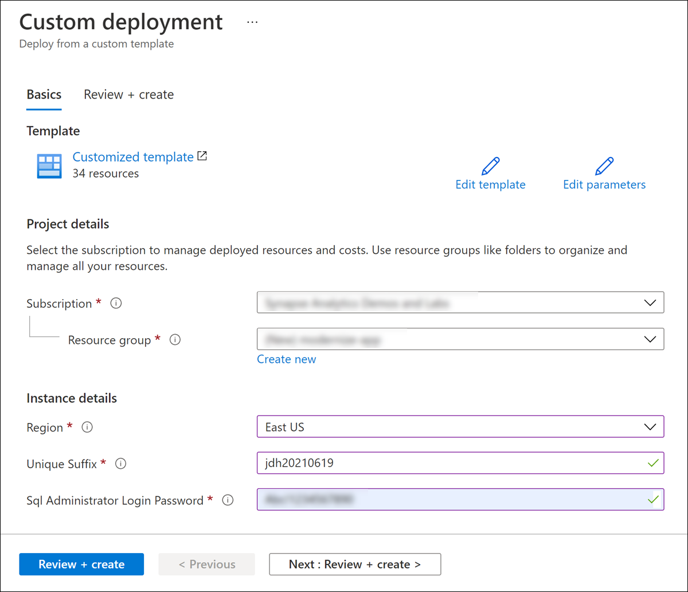

Innovate and modernize apps with Data and AI

Before the hands-on lab setup guide

August 2020

Information in this document, including URL and other Internet Web site references, is subject to change without notice. Unless otherwise noted, the example companies, organizations, products, domain names, e-mail addresses, logos, people, places, and events depicted herein are fictitious, and no association with any real company, organization, product, domain name, e-mail address, logo, person, place or event is intended or should be inferred. Complying with all applicable copyright laws is the responsibility of the user. Without limiting the rights under copyright, no part of this document may be reproduced, stored in or introduced into a retrieval system, or transmitted in any form or by any means (electronic, mechanical, photocopying, recording, or otherwise), or for any purpose, without the express written permission of Microsoft Corporation.

Microsoft may have patents, patent applications, trademarks, copyrights, or other intellectual property rights covering subject matter in this document. Except as expressly provided in any written license agreement from Microsoft, the furnishing of this document does not give you any license to these patents, trademarks, copyrights, or other intellectual property.

The names of manufacturers, products, or URLs are provided for informational purposes only and Microsoft makes no representations and warranties, either expressed, implied, or statutory, regarding these manufacturers or the use of the products with any Microsoft technologies. The inclusion of a manufacturer or product does not imply endorsement of Microsoft of the manufacturer or product. Links may be provided to third party sites. Such sites are not under the control of Microsoft and Microsoft is not responsible for the contents of any linked site or any link contained in a linked site, or any changes or updates to such sites. Microsoft is not responsible for webcasting or any other form of transmission received from any linked site. Microsoft is providing these links to you only as a convenience, and the inclusion of any link does not imply endorsement of Microsoft of the site or the products contained therein.

© 2021 Microsoft Corporation. All rights reserved.

Microsoft and the trademarks listed at <https://www.microsoft.com/legal/intellectualproperty/Trademarks/Usage/General.aspx> are trademarks of the Microsoft group of companies. All other trademarks are property of their respective owners.

**Contents**

<!-- TOC -->

- [Innovate and modernize apps with Data and AI before the hands-on lab setup guide](#innovate-and-modernize-apps-with-data-and-ai-before-the-hands-on-lab-setup-guide)
  - [Requirements](#requirements)
  - [Before the hands-on lab](#before-the-hands-on-lab)
    - [Task 1: Create an Azure resource group using the Azure Portal](#task-1-create-an-azure-resource-group-using-the-azure-portal)
    - [Task 2: Deploy Azure resources](#task-2-deploy-azure-resources)
    - [Task 3: Provision an Ubuntu Virtual Machine](#task-3-provision-an-ubuntu-virtual-machine)
    - [Task 4: Download the Hands-On Lab Contents](#task-4-download-the-hands-on-lab-contents)

<!-- /TOC -->

# Innovate and modernize apps with Data and AI before the hands-on lab setup guide

## Requirements

1. Microsoft Azure subscription must be pay-as-you-go or MSDN.

    a. Trial subscriptions will not work.

2. Install [Visual Studio Code](https://code.visualstudio.com/).

    a. Install the [Azure IoT Tools extension](https://marketplace.visualstudio.com/items?itemName=vsciot-vscode.azure-iot-tools).

    b. Install the [C# for Visual Studio Code extension](https://marketplace.visualstudio.com/items?itemName=ms-dotnettools.csharp).

    c. Install the [Azure Functions extension](https://marketplace.visualstudio.com/items?itemName=ms-azuretools.vscode-azurefunctions).

3. Install [the Azure Machine Learning SDK for Python](https://docs.microsoft.com/python/api/overview/azure/ml/install?view=azure-ml-py).

4. Install [Azure Data Studio](https://docs.microsoft.com/sql/azure-data-studio/download-azure-data-studio).

    a. Install the [PostgreSQL extension](https://docs.microsoft.com/sql/azure-data-studio/postgres-extension).

5. Install Docker. [Docker Desktop](https://www.docker.com/products/docker-desktop) will work for this hands-on lab and supports Windows and MacOS. For Linux, install the Docker engine through your distribution's package manager.

6. Install [Power BI Desktop](https://aka.ms/pbidesktopstore).

7. Install the latest version of [the .NET Core 3.1 SDK](https://dotnet.microsoft.com/download/dotnet/3.1).

## Before the hands-on lab

Duration: 15 minutes

In this exercise, you will set up your environment for use in the rest of the hands-on lab. You should follow all steps provided before attending the Hands-on lab.

### Task 1: Create an Azure resource group using the Azure Portal

In this task, you will use the Azure Portal to create a new Azure Resource Group for this lab.

1. Log into the [Azure Portal](https://portal.azure.com).

2. On the top-left corner of the portal, select the menu icon to display the menu.

    

3. In the left-hand menu, select **Resource Groups**.

4. At the top of the screen select the **+ New** option to add a new resource group.

   

5. Create a new resource group with the name **modernize-app**, ensuring that the proper subscription and region nearest you are selected. **Please note** that currently, the only regions available for deploying to the Azure Database for PostgreSQL Hyperscale (Citus) deployment option are East US, East US 2, West US 2, North Central US, Canada Central, Australia East, Southeast Asia, North Europe, UK South, and West Europe. It is therefore recommended that you choose one of these regions for your resource group and all created resources. Once you have chosen a location, select **Review + Create**.

   

6. On the Summary blade, select **Create** to provision your resource group.

### Task 2: Deploy Azure resources

The below ARM template deploys several Azure resources for the labs, including Azure Synapse Analytics, Azure Database for PostgreSQL, storage accounts, Event Hubs, Stream Analytics, Key Vault, Azure Cosmos DB, Azure Machine Learning, etc.

1. Deploy the workspace through the following Azure ARM template (select the button below):

    

2. On the **Custom deployment** form fill in the fields described below.

   - **Subscription**: Select your desired subscription for the deployment.
   - **Resource group**: Select the resource group you previously created.
   - **Region**: The region where your Azure Synapse environment will be created.

        > **Important**: The `Region` field under 'Parameters' will list the Azure regions where Azure Synapse Analytics is available as of November 2020. This will help you find a region where the service is available without being limited to where the resource group is defined.

   - **Unique Suffix**: This unique suffix will be used naming resources that will created as part of your deployment, such as your initials followed by the current date in YYYYMMDD format (ex. `jdh20210615`). Make sure you follow correct Azure [Resource naming](https://docs.microsoft.com/en-us/azure/cloud-adoption-framework/ready/azure-best-practices/naming-and-tagging#resource-naming) conventions.
   - **SQL Administrator Login Password**: Provide a strong password for the SQLPool that will be created as part of your deployment. [Visit here](https://docs.microsoft.com/en-us/sql/relational-databases/security/password-policy?view=sql-server-ver15#password-complexity) to read about password rules in place. Your password will be needed during the next steps. Make sure you have your password noted and secured.

   

3. Select the **Review + create** button, then **Create**. The provisioning of your deployment resources will take approximately 6 minutes.

    > **Note**: You may experience a deployment step failing in regards to Role Assignment. This error may safely be ignored.

### Task 3: Provision an Ubuntu Virtual Machine

In the hands-on lab, you will use an Ubuntu virtual machine to send sensor data.

1. In the [Azure portal](https://portal.azure.com), type in "virtual machines" in the top search menu and then select **Virtual machines** from the results.

    

2. Select **+ Add** on the Virtual machines page and then select the **Virtual machine** option.

3. In the **Basics** tab, complete the following:

   | Field                          | Value                                              |
   | ------------------------------ | ------------------------------------------         |
   | Subscription                   | _select the appropriate subscription_              |
   | Resource group                 | _select `modernize-app`_                           |
   | Virtual machine name           | _`modernize-app-vm`_                               |
   | Region                         | _select the resource group's location_             |
   | Availability options           | _select `No infrastructure redundancy required`_   |
   | Image                          | _select `Ubuntu Server 18.04 LTS - Gen1`_          |
   | Azure Spot instance            | _leave unchecked_                                  |
   | Size                           | _select `Standard_D2s_v3`_                         |
   | Authentication type            | _select `SSH public key`_                          |
   | Username                       | _select `iotuser`_                                 |
   | SSH public key source          | _select `Generate new key pair`_                   |
   | Key pair name                  | _select `modernize-app-vm_key`_                    |
   | Public inbound ports           | _select `Allow selected ports`_                    |
   | Select inbound ports           | _select `SSH (22)`_                                |

   

4. Select **Review + create**. On the review screen, select **Create**.

5. A modal dialog will appear to generate a new key pair.  Select **Download private key and create resource**. This will create the SSH key, and you will download a file named modernize-app-vm_key.pem.

    

6. Copy this private key to a location on your drive, such as `C:\Temp`. The private key must be accessible only to the current user, with no permissions for other users or groups. To accomplish this in Windows, right-click on the key and select **Properties**. On the **Security** tab, select **Advanced**.

    

7. In Advanced Security Settings, ensure that you are the owner. If not, select **Change** and change the owner to your account.

8. In Advanced Security Settings, select **Disable inheritance** and select **Remove all inherited permissions from this object.** on the ensuing modal dialog.

    

9. In the Permissions tab on Advanced Security Settings, **Remove** any entries other than your user account.

    

10. If there is not already an entry for your account, select **Add** to add a new permission. Select **Select a principal** to add your account and then select **Full control** to give full control of the permissions file to your account. Then select **OK** for each open dialog to complete these changes.

    

11. After the deployment succeeds, select the **Go to resource** button.

12. In the **Settings** section on the menu, select **Connect** and then **SSH**.  This will provide instructions on how to connect to the VM, including the IP address you will use for the connection.

    

13. If you are running Windows 10 version 1709 (Fall Creators Update) or later, Windows has a built-in `ssh` command. Run the following command to ensure that your SSH key is configured correctly. Be sure to change the private key location and IP address as needed.

    `ssh -i #FILE_LOCATION#\modernize-app-vm_key.pem iotuser@#VM_IP_ADDRESS#`

    > **Important:**  If you receive an error message which includes "WARNING: UNPROTECTED PRIVATE KEY FILE!", please ensure that you have completed the above steps and set file permissions for the private key.

    > **Note:** If you are running a version of Windows which does not include built-in SSH support, you can use an [SSH client like PuTTY](https://docs.microsoft.com/azure/marketplace/partner-center-portal/create-azure-vm-technical-asset#connect-to-a-linux-based-vm) to connect to your virtual machine. If you are using Linux or MacOS, you should already have the `ssh` command installed. In that case, be sure to run `chmod 400 modernize-app-vm_key.pem` to set the file as read-only and accessible only to your user account before attempting to connect.

### Task 4: Download the Hands-On Lab Contents

1. Read through both steps of this task.  Once you have done that, scroll back to the top of this document and return to the top level of the repository.

    

2. Select **Code** and then select **Download ZIP** to download a compressed archive file contents. This includes files in the **Hands-on lab\Resources** folder which will be necessary for the hands-on lab.

    

You should follow all steps provided *before* performing the Hands-on lab.
